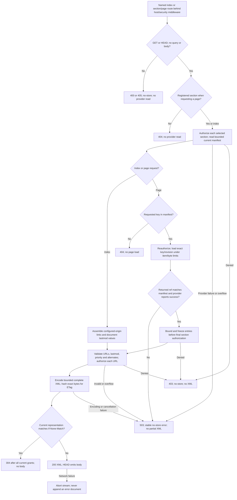

# Public sitemap pages and indexes

Import `github.com/Newton-School/gogo/core/contrib/sitemaps`. `Renderer` validates,
authorizes and encodes complete documents; `Provider` supplies application-scoped
stable page references and content. No Admin, Async or Site database is required.
See `example_test.go` for executable client examples.

| API | Responsibility |
|---|---|
| `New(Config)` | Freeze configured origin, directory, alternate origins, policy and limits; require at least a page or index policy |
| `RenderPage(ctx, entries)` | One complete URL set; `Policy.Entry` required; every alternate also requires `Policy.Alternate` |
| `RenderIndex(ctx, entries)` | One complete index; `Policy.Index` required for each linked sitemap |
| `BuildPages(ctx, entries)` | Split one bounded ordered batch by actual escaped XML bytes and item count, keeping entries intact; return all documents or none |
| `Routes(sections, options)` | Return named `sitemap_index` and `sitemap_page` routes; both entry/index policies and section authorization required |
| `Handler(sections, options)` | Ready-to-mount router using those routes |
| `Provider.Manifest(ctx, limit)` | Stable ordered page keys, opaque revision and optional document modification metadata; limit includes one overflow sentinel |
| `Provider.LoadPage(ctx, ref, limits)` | Exact requested reference and page; query scope, coherent snapshot, stable ordering, byte/count pagination and stale-revision refusal remain provider responsibilities |

Routes are `Directory + sitemap.xml` and
`Directory + sitemap-<section>.<page>.xml`. Register them without an additional
path prefix; namespace-only `urls.Include` is safe. Section names are lowercase
identifiers; page keys are bounded URL-safe opaque tokens, not SQL identifiers,
connection aliases, file paths or executable expressions. Unknown sections/pages
never broaden the source. Requests reread manifests; provider errors/stale refs
are not treated as empty pages.

## Metadata and publication boundaries

| Field / setting | Contract |
|---|---|
| `Origin` | Configured HTTP(S) authority; never copied from request Host or forwarded headers |
| `Directory` | Canonical safe root-relative directory, default `/`; primary URLs and index targets must remain beneath it on the configured origin |
| `Entry.Loc` | HTTP(S) absolute or root-relative URL; origin and Unicode URI encoding normalize, while path/query percent spelling and query order remain supplied by the application; no userinfo, fragment, controls, ambiguous path traversal or malformed escaping; bounded below 2,048 encoded bytes |
| Query parameters | Syntactically validated and preserved; only application publication policy can determine whether a query carries private data |
| `LastMod` | Optional exact `YYYY-MM-DD` date OR an instant; never both. Date-only values remain dates, instants serialize in UTC. Provider supplies actual content/document modification time, not generation time |
| `ChangeFreq` | Optional `always`, `hourly`, `daily`, `weekly`, `monthly`, `yearly` or `never` |
| `Priority` | Optional finite 0–1 value, encoded as decimal without exponent notation |
| `Alternates` | Explicit locale/URL pairs, including self when present; unique normalized language labels, optional `x-default`, bounded count. Extra origins require explicit allowlisting and their own publication grant |
| Reciprocal locales | Provider must publish a coherent complete sibling set on every related page. Rendering one page cannot prove cross-page reciprocal links or remote ownership |
| Policies | Detached read-only values; mutation of current callback metadata rejects the operation. Origin/site selection alone is not public-content authorization |
| Provider snapshots | Stable revision identity is checked before output. Providers must bind it to real content, use coherent database snapshots and honor context. Framework checks do not turn an arbitrary callback into a trusted database snapshot |

## Bounds, splitting and delivery

Defaults are 1,000 entries and 1 MiB per document, 100 pages per build and a
16 MiB aggregate metadata/build budget. Protocol ceilings are 50,000 entries
and 50 MiB per document; build ceilings are 1,000 pages, 1,000,000 entries and
128 MiB. The default aggregate budget grows to at least the configured document
limit. It separately bounds owned input metadata in every operation, and all
encoded output in `BuildPages`; document byte limits measure actual XML bytes.

`BuildPages` includes XML framing and escaping in its split decisions. An entry
too large for a single page, duplicate canonical URL anywhere in a batch, denied
grant, overflow or cancellation returns no documents. Empty input produces one
empty URL set. Returned bytes are owned. This helper does not publish files or
create a provider manifest: the application must atomically publish the finished
documents/index or use a coherent precomputed provider. Large generation can be
scheduled explicitly through Async; this package never starts jobs implicitly.

HTTP defaults to `private, no-cache`. `PublicCache` explicitly opts into shared
storage with mandatory revalidation for cookie/authorization-independent public
representations. Exact-body ETags are checked only after current authorization;
item timestamps never provide an `If-Modified-Since` shortcut. Errors are stable
403/503 no-store responses without provider details. Callbacks must honor the
deadline (default 30 seconds); Go callback execution is not forcibly interrupted.

The implementation follows the [sitemap protocol](https://www.sitemaps.org/protocol.html)
and [locale alternate guidance](https://developers.google.com/search/docs/specialty/international/localized-versions#sitemap).
Gzip, search-engine submission, robots.txt mutation and news/image/video
extension vocabularies are not implemented here. Full contrib conformance
is not claimed.
