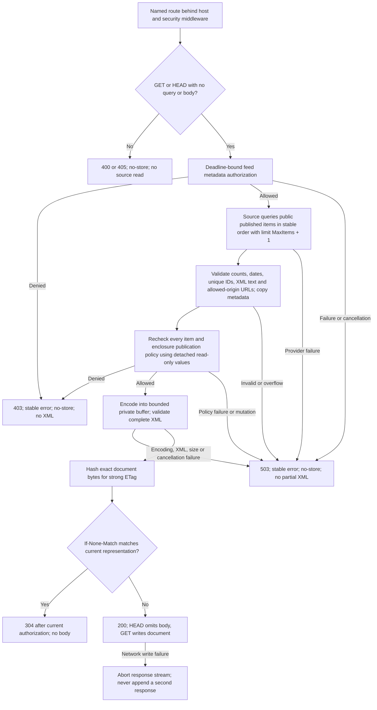

# Public RSS and Atom feeds

Import `github.com/Newton-School/gogo/core/contrib/syndication`. Construct a
`Renderer` with a configured origin, `RSS2{}` (default) or `Atom1{}`, and an
explicit public-item policy. Call `Render(ctx, feed)` for owned document bytes,
or register `renderer.Handler(source, options)` in the app's named `urls.Path`.
See the executable client example in `example_test.go`.

| Boundary | Behavior |
|---|---|
| Publication | `HandlerOptions.Authorize` is mandatory before the source; `Policy.Item` is mandatory for every item; `Policy.Enclosure` is mandatory when enclosures exist. A missing grant or exact `ErrNotPublic` denies the whole feed, never silently drops content. |
| Source | Application-owned query uses tenant/site scope, public status and publication-time filters, stable ordering with an identity tie-breaker, and the supplied limit. Return overflow/error explicitly. The framework preserves order and does not invent queries, authorization or metadata timestamps. |
| Consistency | Source and policies must use a coherent application snapshot if publication changes concurrently. The renderer itself opens no transaction. A site selector or matching origin is not authorization. |
| URLs | HTTP(S) absolute or root-relative links only; feed/self links stay on `Origin`. Other links require that origin or an explicit `AdditionalOrigins` entry. DNS A-labels/ASCII and IP literals are supported; no IDNA conversion, DNS lookup or asset fetch occurs. |
| Enclosures | Explicit public policy, nonnegative byte length and parameter-free MIME type; no URL query or fragment, credentials or signed/private storage URLs. Public paths remain an application decision, not something URL validation can prove. |
| Text | XML 1.0 UTF-8 text is escaped, never interpolated as raw XML. Descriptions are plain text unless trusted application code explicitly sets `Content.HTML` after applying its HTML policy; XML escaping is not an HTML sanitizer. |
| Dates | Required feed/item `Updated`, optional item `Published`, valid years 1–9999; publication cannot follow item update, and item update cannot follow feed update. Output uses UTC. |
| Limits | Defaults: 100 items, 1 MiB document, 30-second HTTP deadline. Configurable maxima: 10,000 items, 16 MiB, 5 minutes. Metadata, nesting, category/enclosure counts and custom output are separately bounded. No silent truncation. Callbacks must honor context; Go callbacks are not forcibly killed. |
| Caching | Default `private, no-cache`; explicit `PublicCache` allows shared storage only for cookie/authorization-independent public content with mandatory revalidation. All checks rerun before 304. HTTP uses exact-body ETags, not `If-Modified-Since`: an unchanged maximum item date cannot detect deletion or visibility changes. `Document.LastModified` is informational. |
| Failures | Programmatic calls return no document on validation, denial, panic, provider error, cancellation or overflow. HTTP exposes stable 403/503 errors without callback details; malformed transport is 400/405. Error responses are `no-store`. |
| Concurrency | Renderer state is captured per operation and handler registration; supplied slices and metadata views are detached. User callbacks/custom formats remain trusted code and must be safe for concurrent use. Do not mutate input/config concurrently with calls. |

## Format mappings

| Metadata | RSS 2.0 | Atom 1.0 |
|---|---|---|
| Feed title, description, URL | Channel title, HTML-safe description, link; Atom self-link extension | Text title, typed subtitle, alternate and self links |
| Feed identity | No native RSS field | Absolute IRI, unchanged; defaults to normalized self URL |
| Item identity | Opaque GUID unless explicitly `IDIsPermalink`; missing ID defaults to normalized item link | Absolute IRI, unchanged; missing ID defaults to normalized item link |
| Item title / description | At least one; HTML-safe description | Required title; typed text/HTML summary and required alternate link |
| Authors | Mailbox plus escaped name; name-only uses Dublin Core creator | Feed author inherited by entries, or author on every entry; empty feed requires feed author; name/email/URI |
| Dates | Feed `lastBuildDate`, optional item `pubDate`; no native item-updated field | Feed/entry `updated`, optional entry `published` |
| Categories | Term and optional domain | Term, optional scheme and label |
| Enclosures | At most one per item, URL/length/type | Up to configured metadata limit (16) as enclosure links |
| Other metadata | Language, generator, feed copyright, item comments | Language, generator, feed/item rights |

RSS does not serialize author URI, category label or per-item copyright; Atom
does not serialize RSS comments/permalink flags. These are format distinctions,
not invented extensions. The common rendering boundary still validates supplied
metadata. Explicit Atom IDs follow RFC 3987 syntax and are not rewritten as URLs.

## Custom formats

Implement `Format.ContentType()` and `Format.Encode(ctx, writer, normalizedFeed)`.
Use `Render`/`Handler` for validation, policies and atomic document output;
calling a built-in `Encode` directly is a lower-level streaming operation that
does not apply those boundaries. Custom formats must use an allowed XML MIME
type, UTF-8, one XML root and no DTD or processing instructions other than an
initial XML 1.0 declaration. They receive a detached copy and a bounded writer;
they must not close it or perform external I/O. Validation is not a sandbox for
hostile Go plugins or a schema validator for arbitrary custom namespaces.

The contracts are informed by [RSS 2.0](https://www.rssboard.org/rss-specification),
[Atom 1.0](https://www.rfc-editor.org/rfc/rfc4287), and
[Django syndication](https://docs.djangoproject.com/en/6.0/ref/contrib/syndication/).
Dynamic object lookup, template-backed feed descriptions, RSS 0.91, and arbitrary
extension-element helpers are not provided by this package yet; application
sources and explicit `Format` implementations remain its extension points.
